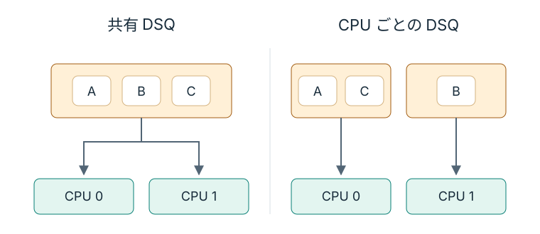

# CPU ごとの DSQ

本編の共有 DSQ は、どの CPU も同じ待ち行列からタスクを受け取れる。
空いた CPU へ仕事を渡しやすい一方、タスクが前回と異なる CPU で実行される機会もある。
CPU を移ると、前回の CPU で温まっていたキャッシュをそのまま再利用できない場合がある。

ここで現れるのは、仕事を空いた CPU へ分散しやすくすることと、同じ CPU で動かして locality を保つことのトレードオフである。
どちらを優先するかは workload によって変わる。

## 設計の違い

本編の共有 DSQ と、CPU ごとに待ち行列を持つ構成を概念的に比べると次のようになる。

<figure class="technical-figure">

<figcaption>A〜C はタスク。右は CPU ごとに独自 DSQ を用意する構成で、両側ともローカル DSQ と callback は省略している。</figcaption>
</figure>

この構成の違いだけで「どちらが速いか」は決まらない。
短いタスクが大量に到着し、空いた CPU をすぐ使いたい workload と、同じタスクが繰り返し CPU を使い、キャッシュの再利用が効く workload では評価が変わる。

右の図で B が終了し、CPU 1 だけが空いたとする。
図に描かれた経路だけで、CPU 1 は A や C を取り出せるだろうか。
それらは CPU 0 側の列にあるため、CPU 1 から取り出すには別の規則が必要になる。
同じ CPU で動かす方針を強めるほど、負荷が偏ったときにどう分け直すかも設計の対象になる。

## 何を測るか

比較実験を作るなら、本編と同じく一度に変える条件を一つにする。
タイムスライスは固定し、キューの配置だけを変える。

候補になる観測値は次のようなものだ。

- CPU migration の回数
- タスクごとの実行時間や遅延
- workload 全体の throughput
