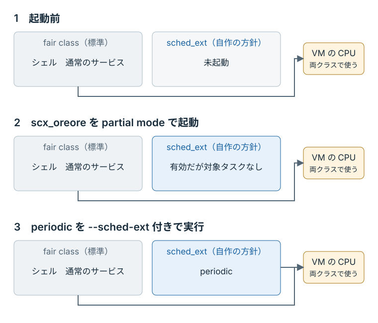

# 最初のスケジューラを動かす

Windows では、[Windows 向けの環境準備](./windows.md)を済ませ、ホスト側に MSYS2 MSYS の端末を使う。
以下の `make` コマンドは macOS と Windows で共通である。

用意されたスケジューラを VM にロードし、一つの周期タスクを動かしてから解除する。
ロードできたかはスケジューラ名で、タスクが実行されたかは出力で確認する。
最後にカーネルが示す状態を読み、自作スケジューラが外れたことまで確かめる。

## 編集するファイルと完成例

ホスト上で取得した `sched-ext-tutorial` を、普段のエディタで開く。
本文の `make` コマンドはホスト側のリポジトリ直下で実行するため、VM のシェルに入っている場合は `exit` で戻っておく。

編集するファイルは `lab` に、各段階の完成例は `checkpoints` に入っている。

```text
sched-ext-tutorial/
├── lab/
│   └── src/
│       ├── bpf/main.bpf.c   ← スケジューラの方針
│       └── main.rs         ← カーネルへ読み込むプログラム
└── checkpoints/
    ├── step-01-global/     ← 最初に動かす完成例
    ├── step-02-long-slice/ ← スライスを2秒にした完成例
    └── …
```

最初に `step-01-global` を lab へコピーする。**
`make restore` は lab の BPF ファイルを上書きする。
すでに編集した内容を残す場合は、実行前に別のファイルへ保存する。
**

```console
make restore STEP=01
```

## ビルドしてロードする

ホスト側で端末を二つ開き、どちらもリポジトリ直下へ移動する。
端末1ではスケジューラを起動したままにし、端末2から状態の確認とタスクの実行を行う。

| 端末 | 作業する場所 | 役割 |
|---|---|---|
| 端末1 | ホストのリポジトリ直下 | ビルド、起動、終了 |
| 端末2 | `make vm-shell` で入る VM 内 | 状態の確認とタスクの実行 |

端末1でビルドする。

```console
make build STEP=lab
```

`STEP=lab` は、編集先の lab を使う指定である。
`STEP=01` では checkpoint 側を使うため、lab に加えた変更は反映されない。

ビルドは、VM にマウントされたソースを使って VM 内で行われる。
エラーなくプロンプトへ戻れば実行ファイルはできているが、まだスケジューラは有効になっていない。
次に、BPF プログラムをカーネルへ読み込む Rust の loader（`lab/src/main.rs`）を起動する。

端末1で次を実行する。
このコマンドもビルドを行い、その後 VM 内で loader を起動する。

```console
make run STEP=lab MODE=partial
```

**partial mode**（`MODE=partial`）では、指定したタスクだけを自作スケジューラで動かせる。
この教材では、負荷生成器に `--sched-ext` を付けると、そのタスクが対象になる。

`scx_oreore` を起動しただけでは、シェルや通常のサービスの担当は変わらない。
これらは従来どおり、通常のタスクへ CPU 時間を分配する Linux 標準の **fair class** で動く。

<figure class="technical-figure">
<div class="diagram-scroll" tabindex="0" role="region" aria-label="partial mode の起動前後と対象タスクの実行（横スクロール可能）">

</div>
<figcaption>この手順での変化。あらかじめ SCHED_EXT を選んだタスクがない状態を示す。リアルタイムクラスなどは省略している。</figcaption>
</figure>

起動すると、端末1に次の行が表示される。

```text
scx_oreore started (mode=partial, slice=20000 us)
```

この後にプロンプトが戻らないのは、loader がスケジューラへの接続を保っているためである。
端末1はそのままにして、端末2で VM に入る。

```console
make vm-shell
```

以降、この章の端末2の操作は VM 内で行う。
まず、スケジューラの状態と名前を確認する。

```console
cat /sys/kernel/sched_ext/state
cat /sys/kernel/sched_ext/root/ops
```

`state` は有効かどうかを、`root/ops` は現在のスケジューラ名を示す。
出力例は次のとおりである。

```console
$ cat /sys/kernel/sched_ext/state
enabled
$ cat /sys/kernel/sched_ext/root/ops
oreore_0.1.0_aarch64_unknown_linux_gnu
```

`enabled` と `oreore` で始まる名前が確認できれば、ロードに成功している。
名前の後半はバージョンやビルド環境によって変わる。

起動ログが出ずに終了した場合や、`enabled` にならない場合は、端末1のエラーを[トラブルシューティング](../appendix/troubleshooting.md)と照らし合わせる。

## 対象タスクを一つ動かす

自作スケジューラのもとでタスクが実行されることを確かめるため、教材の負荷生成器にある **`periodic`** を使う。
これは、1 秒間隔の予定時刻に処理を再開し、その時刻からの遅れを出力する周期タスクである。

端末2で負荷生成器をビルドする。

```console
cd /workspace/sched-ext-tutorial
./scripts/guest/build-workload.sh
```

続けて、周期タスクを実行する。

```console
sudo /var/cache/sched-ext-tutorial/target/workload/release/sched-ext-workload \
    periodic --samples 3 --sched-ext
```

`--samples 3` は三つの標本を記録する指定、`--sched-ext` はこのタスクを自作スケジューラの対象にする指定である。
見出しに続いて三つの標本と集計が出て、エラーなくプロンプトへ戻ることを確認する。

この実行で確認できるのは、一つのタスクが処理を進めて完了したことまでである。
目に見える速さの違いが出るとは限らない。
待ち時間の差は、[1秒後に戻れないタスク](long-slice.md)で複数のタスクを競合させて測る。

## 終了して元のスケジューラへ戻す

周期タスクが終了しても、端末1の loader は接続を保っている。
端末1で `Ctrl+C` を押し、接続を解放して自作スケジューラを外す。
続いて端末2で `/sys/kernel/sched_ext/state` を読み、`disabled` と表示されることを確認する。

```console
$ cat /sys/kernel/sched_ext/state
disabled
```

解除後は `root/ops` がなくなるため、ここでは `state` を読む。
終了できない場合は、ホスト側の別の端末から `make reset` を実行する。

確認が終わったら、端末2で `exit` を実行し、ホスト側へ戻っておく。

<details>
<summary>loader が保持しているもの</summary>

loader は BPF object を開き、設定を与えてから load、attach する。
partial mode では、load 前に `SCX_OPS_SWITCH_PARTIAL` を設定する。
これにより、**`SCHED_EXT`** というスケジューリング方針を選んだタスクだけが対象になる。
この切り替え方を **partial switching** と呼ぶ。

負荷生成器は、`--sched-ext` を指定すると `sched_setscheduler(2)` で自分の方針を `SCHED_EXT` に変更する。

attach で作られる **BPF link** は、スケジューラとの接続を表す。
この loader は link をプロセス内に保持し、終了時に解放する。
そのため、`Ctrl+C` で loader を終了すると、自作スケジューラも外れる。

</details>
