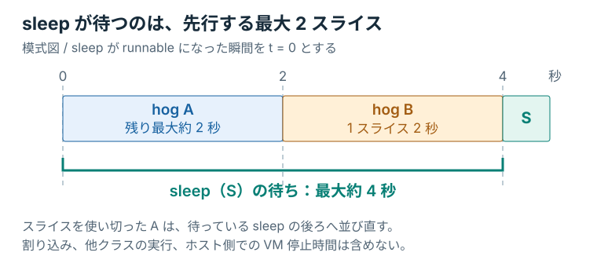
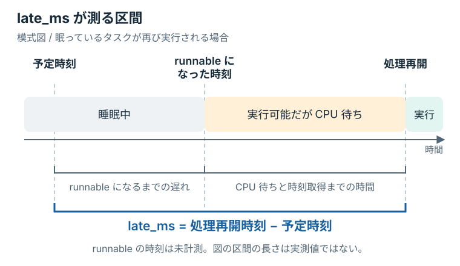

# 1秒後に戻れないタスク

共有 DSQ を通してタスクを動かせるようになった。
周期タスクだけでは、順番待ちの影響はまだ見えにくい。
同じ CPU を使い続ける相手を置き、スライスを 2 秒へ伸ばしてみる。

## 同じ CPU を使う三つのタスク

計算を続けるタスクを二つと、前に使った周期タスクを一つ、CPU 0 に固定する。
主に CPU 計算を続ける仕事を **CPU-bound** と呼ぶ。
負荷生成器の `cpu-hog` がその役割を持つ。

| 本文と図での名前 | 負荷生成器 | 動作 |
|---|---|---|
| hog A | `cpu-hog` | 眠らずに計算を続ける |
| hog B | `cpu-hog` | 同じ計算をするもう一つのタスク |
| periodic | `periodic` | 1 秒間隔の予定時刻に処理を再開する |

`hog` は CPU を使い続ける負荷タスクの呼び名である。
A と B は二つを見分けるための名前で、優先度の違いを表していない。

実験では `taskset -c 0` により、三つとも CPU 0 だけで実行できるようにする。
この実行先の制限を **CPU affinity** と呼ぶ。
VM にほかの CPU があっても、三つのタスクは同じ CPU を取り合う。

hog を二つ置くのは、スライスの切れ目で交代する相手を作るためである。
一つだけなら、periodic が眠っている間は同じ hog が続けて走れる。
CPU affinity、タスク数、キュー構造を揃え、まずスライスの長さだけを変える。

## 周期タスクは誰を待つか

hog A が実行中で、共有 DSQ には hog B が待っている。
そこへ periodic が wakeup して末尾に並んだとする。

```text
CPU 0:   [ hog A ]
共有 DSQ: [ hog B ] → [ periodic ]
```

A が CPU を手放したら、B と periodic のどちらが先に動くか。
FIFO なので、先に並んだ B が先である。
periodic は、実行中の A の残り時間と、B に割り当てられた時間を待つ。

各スライスが 2 秒なら、この二つで最大約 4 秒になる。
スライスを使い切った A は末尾へ並び直すので、すでに待っている periodic を追い越さない。

<figure class="technical-figure">
<div class="diagram-scroll" tabindex="0" role="region" aria-label="図3：二つの hog が先行する FIFO の待ち時間（横スクロール可能）">

</div>
<figcaption>図3：A の残りスライスと B のスライスを待つ。単一 CPU の FIFO を単純化したモデル。</figcaption>
</figure>

wakeup が A のスライスの終わりに近ければ、A を待つ時間は短くなる。
割り込みやほかのスケジューラクラス、ホストの都合で VM が停止する時間は、このモデルに含めていない。
実測値の上限を 4 秒と決めるのではなく、数秒単位の遅れが現れるかを見てみよう。

## lab のスライスを 2 秒にする

`lab/src/bpf/main.bpf.c` の `slice_ns` を変更する。
途中から始める場合は、残したい変更を保存してから `make restore STEP=02` で共有 DSQ の完成状態へ戻せる。

```c
const volatile u64 slice_ns = 2000000000ULL;  /* 2 seconds */
```

2 秒は `2,000,000,000` ナノ秒である。
変更したファイルを保存する。
値は前章と同じ `scx_bpf_dsq_insert()` の第3引数からタスクへ渡る。
`enqueue` の投入先と `dispatch` の取り出しはそのままにする。

## ベンチマークを実行する

前章の `make run` が動いていれば、`Ctrl+C` で終了する。
VM 内の `/sys/kernel/sched_ext/state` が `disabled` になったことを確認し、VM のシェルからは `exit` で戻っておく。

比較の基準として、自作スケジューラを使わず fair class で同じ負荷を動かす。
Mac 側のリポジトリ直下で実行する。

```console
mkdir -p target/measurements
make bench CASE=fair 2>&1 | tee target/measurements/fair.log
```

`CASE=fair` は自作スケジューラをロードしないが、すでに動いているものを自動で外すわけではない。
実行前に `disabled` を確認するのは、この条件を揃えるためである。

次に、2 秒へ変更した lab を測定する。

```console
make bench CASE=step STEP=lab 2>&1 | tee target/measurements/long.log
```

`make bench` はビルド、ロード、有効化の確認、負荷生成、停止をまとめて行う。
別の端末で `make run` を起動しておく必要はない。
`tee` で保存したログは、短いスライスとの比較にも使う。

二つの hog はそれぞれ約 20 秒間計算し、periodic は 1 秒間隔の予定時刻に対して 15 標本を記録する。
遅れによって実際の終了時刻は延びうる。
`CASE=step` では三つの負荷生成器が `--sched-ext` を指定し、partial mode の対象へ入る。

完成例を直接試す場合は `STEP=03` を指定できる。
手元で変更した値を試す場合は、ここまでと同じ `STEP=lab` を使う。

## まず最大の遅れを見つける

二つのログで `max_late_ms` を探す。
これは、予定時刻から処理を再開するまでの遅れの最大値で、単位はミリ秒である。
fair class と 2 秒スライスのどちらが大きかったか、一つ選んでから数値を手元に残す。

| 条件 | 自分の `max_late_ms` |
|---|---:|
| fair class |  |
| 2 秒スライス |  |

教材 VM の一回の測定では、fair class が 1.686 ミリ秒、2 秒スライスが 3,468.367 ミリ秒だった。
後者は約 3.47 秒で、先ほど予想した数秒単位の待ちと整合する。
同じ数値になることを成功条件にはしない。
差がほとんどなければ、[実験で遅延が見えない場合](../appendix/troubleshooting.md#実験で遅延が見えない)を確認する。

参考記録は Apple M5 上の 4 vCPU の教材 VM（Ubuntu 26.04、Linux `7.0.0-30-generic`、scx 1.1.3）で、2026 年 9 月 6 日に測定した。
[fair class の全ログ](../measurements/2026-09-06/fair.txt)と[2 秒スライスの全ログ](../measurements/2026-09-06/long.txt)を参照できる。

## 測っている遅れ

出力の `late_ms` は、予定時刻から処理再開までを測っている。
図の黄色い CPU 待ちだけを測っているのか、青い括弧全体なのかを、両端の時刻で確かめてみる。

<figure class="technical-figure">
<div class="diagram-scroll" tabindex="0" role="region" aria-label="図4：予定時刻から処理再開までの測定区間（横スクロール可能）">

</div>
<figcaption>図4：青い括弧が late_ms の測定範囲。runnable になった時刻は測っていない。</figcaption>
</figure>

測っているのは、青い括弧全体である。
負荷生成器は予定時刻と、`sleep` から戻って時刻を読んだ時点を記録する。
runnable になるまでの遅れや、CPU 待ち、時刻取得までの時間が含まれ、VM 自体がホスト側で実行を待つ影響も混ざる。
そのため `late_ms` のすべてを、DSQ での待ち時間と見なすことはできない。

`deadline_missed` は、この遅れが 100 ミリ秒の許容を超えたときに `true` になる。
許容を超えることを、この実験では **deadline miss** と呼ぶ。
最後の `deadline_misses` は、その標本数である。

2 秒スライスの参考記録では、集計は次のようになった。

```text
average_late_ms=1865.578
max_late_ms=3468.367
deadline_misses=15/15

               177      context-switches
```

全 15 標本が許容を超えている。
`177` は、periodic の実行期間中に CPU 0 で起きたコンテキストスイッチの総数である。
三つの実験タスク以外の切り替えも含み、切り替えに費やした時間そのものは測っていない。

<details>
<summary>遅れが約 1 秒ずつ減る標本の読み方</summary>

同じ参考記録の先頭三行は、次のようになっている。

```text
sample,late_ms,deadline_missed
1,2462.364,true
2,1462.380,true
3,462.381,true
```

負荷生成器は、予定時刻を前回の処理再開から 1 秒後に置き直さず、毎回 1 秒ずつ進める。
大きく遅れた後は次の予定時刻も過ぎているため、ほとんど眠らず続けて記録する場合がある。
この三行を、別々の wakeup の後にそれぞれ CPU を待った時間とは解釈しない。
15 標本も、独立した 15 回の wakeup を意味しない。

</details>

15 標本から p95 や p99 のような分布の裾を安定して評価することはできないため、本編では最大遅延と deadline miss 数を比べる。
切り替え回数も総数なので、実行時間が大きく異なる試行をそのまま比較しない。
長い試行へ広げるときは測定時間を保存し、毎秒あたりの回数も求める。

自分のログから最大遅延を一つ拾えれば、スライスを変えた結果を比較する基準ができた。
数値が予想と違った場合も、その値を残しておこう。
