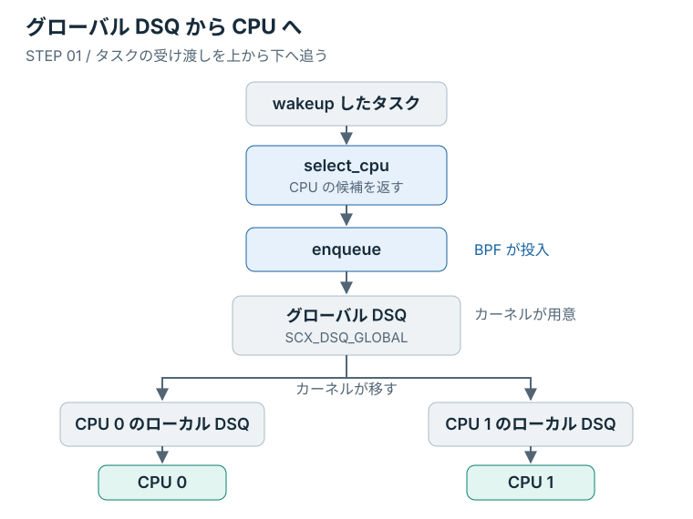

# 一行変えて動かす

前章では、用意されたスケジューラで周期タスクを動かし、終了できた。
今度は、一度 CPU を渡すときの時間を 20 ミリ秒から 30 ミリ秒へ変える。
自分が変えた値を起動ログで確かめた後、その値がタスクへ渡る場所を追ってみよう。

## CPU を渡す時間

Mac 側のエディタで `lab/src/bpf/main.bpf.c` を開く。
前章から続けている場合は、最初の完成例が入っている。
途中から始める場合は、残したい変更を保存してから `make restore STEP=01` で揃える。

ファイルの先頭付近に、次の定数がある。

```c
const volatile u64 slice_ns = 20000000ULL;  /* 20 ms, kernel default */
```

一度の割り当てでタスクが使える CPU 時間を **タイムスライス** と呼ぶ。
`slice_ns` はその長さをナノ秒で指定しており、`20000000` は 20 ミリ秒に当たる。
タスクが途中で眠れば CPU を手放すため、毎回 20 ミリ秒間走り続けるという意味ではない。

続いて、ファイルの中央にある次の一行を探す。

```c
scx_bpf_dsq_insert(p, SCX_DSQ_GLOBAL, slice_ns, enq_flags);
```

タスクを CPU へ渡すための待ち行列を **dispatch queue（DSQ）** と呼ぶ。
この一行は、タスク `p` を組み込みのグローバル DSQ へ入れ、`slice_ns` の時間を割り当てる。

時間だけを変えるなら、待ち行列を指定する `SCX_DSQ_GLOBAL` と、長さを指定する `slice_ns` のどちらを変えるか。
今回は `slice_ns` の初期値だけを変えればよい。
先ほどの定義を次の一行に置き換え、保存する。

```c
const volatile u64 slice_ns = 30000000ULL;  /* 30 ms */
```

## 起動ログで確かめる

前章と同じく、端末1は Mac のリポジトリ直下、端末2は VM 内の確認に使う。
前章の loader は終了し、`state` が `disabled` になっている状態から始める。

端末1で、編集した lab を起動する。

```console
make run STEP=lab MODE=partial
```

起動ログの `slice` を探す。
ログはマイクロ秒単位なので、30 ミリ秒なら `30000 us` と表示される。

```text
scx_oreore started (mode=partial, slice=30000 us)
```

`20000 us` のままなら、ファイルを保存したか、編集先が lab か、`STEP=lab` を指定したかを確かめる。
`30000 us` になれば、変更した値がビルドとロードを経て使われている。

端末2から VM に入り、周期タスクを再び動かす。
負荷生成器は前章でビルド済みである。

```console
make vm-shell
cat /sys/kernel/sched_ext/state
sudo /var/cache/sched-ext-tutorial/target/workload/release/sched-ext-workload \
    periodic --samples 3 --sched-ext
```

`enabled` と三つの標本を確認したら、端末1で `Ctrl+C` を押す。
端末2で解除を確認し、Mac 側へ戻る。

```console
cat /sys/kernel/sched_ext/state
exit
```

`disabled` に戻ったら、C ファイルの定義とコメントを 20 ミリ秒へ戻して保存する。

```c
const volatile u64 slice_ns = 20000000ULL;  /* 20 ms, kernel default */
```

ソースの保存は、次回のビルドに使う値を変える操作である。
すでにロード中の値を変更するには、今回のように終了して、ビルドとロードをやり直す。

<details>
<summary>ナノ秒と設定値の宣言</summary>

1 ミリ秒は 1,000 マイクロ秒、1,000,000 ナノ秒である。
ソースの `slice_ns` はナノ秒、起動ログの `slice` はマイクロ秒を使う。

`u64` は符号なし64ビット整数で、`ULL` は `unsigned long long` 型の整数リテラルを表す。
`const volatile` は、BPF 側から読み取り専用の設定値として使うための宣言である。

loader は load 前なら、**rodata** と呼ばれる読み取り専用データ領域の初期値を変更できる。
教材の loader は `--slice-us` が指定された場合だけ値を上書きする。
本文の `make run` では指定しないため、C ファイルの初期値が使われる。

</details>

## この一行を呼ぶのは誰か

値の変更は反映された。
同じファイルには C の `main()` がないが、待ち行列へ入れる一行はいつ動くのだろうか。

その一行を囲む関数を見ると、`oreore_enqueue` という名前が付いている。

```c
void BPF_STRUCT_OPS(oreore_enqueue, struct task_struct *p, u64 enq_flags)
{
	scx_bpf_dsq_insert(p, SCX_DSQ_GLOBAL, slice_ns, enq_flags);
}
```

これは、カーネルがスケジューリングの途中で呼ぶ callback である。
**`enqueue`** は、スケジューラが受け取った実行可能なタスクを待ち行列へ入れる場面に対応する。
実行可能、つまり CPU を得れば動ける状態を **runnable** とも呼ぶ。

関数を書くだけでは、その場面で呼ばれるようにはならない。
ファイル末尾の `SCX_OPS_DEFINE` が、役割と関数を対応付けている。

```c
SCX_OPS_DEFINE(oreore_ops,
	       .select_cpu = (void *)oreore_select_cpu,
	       .enqueue    = (void *)oreore_enqueue,
	       .exit       = (void *)oreore_exit,
	       .timeout_ms = 5000,
	       .name       = "oreore");
```

`.enqueue = (void *)oreore_enqueue` を読むと、カーネルが求める `enqueue` の役割に、このファイルの関数が登録されている。
callback と設定をまとめてカーネルへ渡す構造体を **`sched_ext_ops`** と呼ぶ。
`.name` の `oreore` は、前章で確認したスケジューラ名の先頭と同じである。

<details>
<summary>関数定義と四つの引数</summary>

`BPF_STRUCT_OPS` は、カーネルから callback として呼べる形で関数を定義するマクロである。
`p` はタスクを表す `task_struct` へのポインタ、`enq_flags` は投入時の条件を表すフラグである。
`scx_bpf_dsq_insert()` は、カーネルが BPF プログラムへ公開している関数である。

| 引数 | 渡す値 | 指定すること |
|---|---|---|
| 第1引数 | `p` | どのタスクか |
| 第2引数 | `SCX_DSQ_GLOBAL` | どの待ち行列か |
| 第3引数 | `slice_ns` | どれだけの CPU 時間か |
| 第4引数 | `enq_flags` | どの投入条件か |

</details>

## 待ち行列から CPU へ

タスクはグローバル DSQ に入った。
そこから CPU へ渡す部分は、まだ自分のコードに見当たらない。

各 CPU は、自分の **ローカル DSQ** からタスクを取り出して実行する。
そこが空なら、カーネルが用意した **グローバル DSQ** も参照できる。
今のコードで投入処理だけを書けばよいのは、カーネルに取り出しを任せているためである。

<figure class="technical-figure">
<div class="diagram-scroll" tabindex="0" role="region" aria-label="図1：グローバル DSQ を使う最小構成（横スクロール可能）">

</div>
<figcaption>図1：青い callback が自作コード。グローバル DSQ からの取り出しはカーネルが担当する。</figcaption>
</figure>

図の入口にある **`select_cpu`** は、wakeup したタスクを動かす CPU の候補を選ぶ callback である。
最小例では、次のように組み込み処理へ委ねている。

```c
s32 BPF_STRUCT_OPS(oreore_select_cpu, struct task_struct *p, s32 prev_cpu,
		   u64 wake_flags)
{
	bool is_idle = false;

	return scx_bpf_select_cpu_dfl(p, prev_cpu, wake_flags, &is_idle);
}
```

`prev_cpu` は前回動いていた CPU で、組み込み処理は空いている CPU を優先して候補を選ぶ。
空いている状態を **idle** と呼ぶ。
`is_idle` で idle CPU を見つけたかを受け取れるが、この最小例では CPU 番号だけを戻り値に使う。

グローバル DSQ は複数の CPU が参照するため、最終的に動く CPU は候補と同じとは限らない。
図の CPU 0 と CPU 1 は受け取り先の例であり、一つのタスクを両方へ複製する図ではない。

残る `oreore_exit` は、スケジューラが外れた理由を記録する callback である。
`UEI_DEFINE` と `UEI_RECORD` は、その記録を loader へ渡すための補助として使う。
通常終了だけでなく、[壊して、戻る](./watchdog.md)でもこの記録を読む。

スライスの値を変えた場所から、`enqueue` 内の `scx_bpf_dsq_insert()` の第3引数までを、コード上でたどってみる。
自分で変えた時間はここからタスクへ渡り、取り出しはカーネルが引き受けている。
