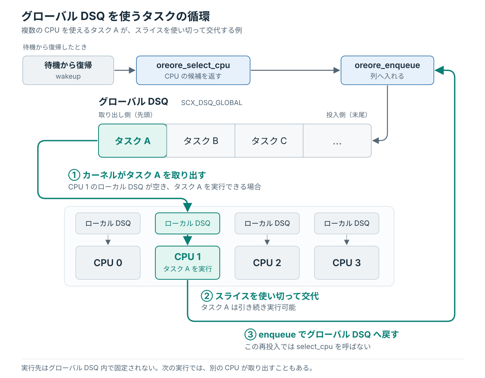

# 最初の main.bpf.c を読む

前章で変更した `slice_ns` は、タスクを待ち行列へ入れるときに CPU 時間の割り当てとして使われる。
その処理が書かれている `lab/src/bpf/main.bpf.c` を、ホスト側のエディタで開く。
カーネルがどの関数を呼び、タスクがどの待ち行列を通って実行されるかを追う。

前章の最後まで進めたコードは、`checkpoints/step-03-short-slice/src/bpf/main.bpf.c` と同じ状態になっている。

## callback をカーネルへ登録する

`main.bpf.c` に `main()` はない。
このファイルの関数は、Linux カーネルがスケジューリングの途中で呼ぶ callback であり、ファイル末尾の `SCX_OPS_DEFINE` で、呼ばれる場面と関数を対応付けている。

```c
SCX_OPS_DEFINE(oreore_ops,
	       .select_cpu = (void *)oreore_select_cpu,
	       .enqueue    = (void *)oreore_enqueue,
	       .exit       = (void *)oreore_exit,
	       .timeout_ms = 5000,
	       .name       = "oreore");
```

`sched_ext` は、callback と設定を **`sched_ext_ops`** という構造体で受け取る。
`SCX_OPS_DEFINE` はその構造体を定義するマクロで、ここでは `oreore_ops` という名前を付けている。

たとえば `.enqueue = (void *)oreore_enqueue` は、タスクを待ち行列へ入れる場面で `oreore_enqueue` を呼ぶという指定である。
Rust の loader（`lab/src/main.rs`）が、この対応付けをカーネルへ読み込んで有効にする。

| 関数 | 呼ばれる場面の例 | このコードがすること |
|---|---|---|
| `oreore_select_cpu` | 待機していたタスクが実行可能になったときや、新しいタスクを初めて動かすとき | CPU の候補を返す |
| `oreore_enqueue` | タスクが待機から復帰したときや、スライスを使い切って別のタスクと交代するとき | 実行待ちの列に入れる |
| `oreore_exit` | スケジューラが終了するとき | 終了理由を記録する |

`timeout_ms = 5000` は、実行可能なのに長く動けないタスクを検出するためのタイムアウトを 5 秒に設定している。
この監視による復帰は、発展編の[壊して、戻る](../advanced/watchdog.md)で確かめる。

## oreore_select_cpu で CPU の候補を選ぶ

wakeup したタスクが使える CPU が複数あると、カーネルは `oreore_select_cpu` を呼び、実行先の候補を求める。
新しく作られたタスクを初めて動かすときにも、この CPU 選択が行われる。

```c
s32 BPF_STRUCT_OPS(oreore_select_cpu, struct task_struct *p, s32 prev_cpu,
		   u64 wake_flags)
{
	bool is_idle = false;

	return scx_bpf_select_cpu_dfl(p, prev_cpu, wake_flags, &is_idle);
}
```

`BPF_STRUCT_OPS` は、callback をカーネルから呼び出せる BPF プログラムとして定義するマクロである。[^callback-definition]
最初の引数に関数名を置き、その後にカーネルから受け取る引数を宣言する。
この関数には、対象タスクが `p`、前回動いていた CPU が `prev_cpu`、wakeup に関する条件が `wake_flags` として渡される。

この実装では、CPU 選びをカーネルの `scx_bpf_select_cpu_dfl()` に任せ、その CPU 番号を返している。
この関数は、タスクが使える CPU の中から空いているものを探す。
選んだ CPU が空いている状態（**idle**）かどうかも `is_idle` で受け取れるが、今の実装では使わない。

ここで行うのは、CPU の候補を返すことまでである。
タスクを実行待ちの列へ入れる処理は、次の `oreore_enqueue` に任せる。

ただし、使える CPU が一つだけなら候補を選ぶ必要がないため、`select_cpu` は省略される。
前章の `taskset -c 0` がこれに当たり、この場合も投入は `enqueue` が担当する。[^cpu-selection]
後の[偶数用と奇数用に振り分ける](shared-dsq.md#oreore_enqueue-で偶数用と奇数用に振り分ける)でも、この分担を保ったまま `enqueue` に分類処理を加える。

## oreore_enqueue で実行待ちの列に入れる

`oreore_enqueue` は、実行可能なタスクを待ち行列へ入れ、次の順番で使うスライスを割り当てる関数である。
実行を待つタスクを列へ入れる処理を **`enqueue`** と呼ぶ。

今のコードでは、wakeup 後や、スライスを使い切ってほかのタスクと交代するときに、カーネルがこの関数を呼ぶ。
スライスを使い切っても引き続き実行可能なら、タスクは再び列に入り、次の順番を待つ。
一方、I/O などの待機に入るタスクは、その時点では列へ戻さない。
待ちが解消して wakeup したときに戻す。

```c
void BPF_STRUCT_OPS(oreore_enqueue, struct task_struct *p, u64 enq_flags)
{
	scx_bpf_dsq_insert(p, SCX_DSQ_GLOBAL, slice_ns, enq_flags);
}
```

`sched_ext` がタスクを CPU へ渡すために使う待ち行列を、**dispatch queue（DSQ）** と呼ぶ。
`scx_bpf_dsq_insert()` は、カーネルから受け取ったタスク `p` を、指定した DSQ へ入れる関数である。

ここでは、複数の CPU で共有する組み込みの **グローバル DSQ**（`SCX_DSQ_GLOBAL`）に投入する。
割り当てるスライスは、前章で変更した `slice_ns` の 10 ミリ秒である。

| 引数 | このコードでの指定 |
|---|---|
| `p` | カーネルから渡されたタスクを入れる |
| `SCX_DSQ_GLOBAL` | 組み込みのグローバル DSQ に入れる |
| `slice_ns` | 今回の CPU 時間として 10 ミリ秒を割り当てる |
| `enq_flags` | カーネルから渡された投入条件をそのまま使う |

グローバル DSQ からは、入った順に取り出す FIFO の規則を使う。
`slice_ns` を変えると、各タスクが一度に使える CPU 時間が変わる。
その結果、同じ列で待つタスクへ順番が回るまでの時間にも影響する。

### 列から取り出すのはカーネル

グローバル DSQ からタスクを取り出す処理はカーネルが持っているため、この BPF ファイルには書かない。
各 CPU には次に実行するタスクを置く **ローカル DSQ** があり、それが空になると、カーネルがグローバル DSQ から、その CPU で実行できるタスクを移す。
CPU はローカル DSQ からタスクを取り出して実行する。

<figure class="technical-figure">
<div class="diagram-scroll" tabindex="0" role="region" aria-label="グローバル DSQ を使うタスクの循環（横スクロール可能）">

</div>
</figure>

図の右側では、スライスを使い切って交代したタスク A を、`oreore_enqueue` がグローバル DSQ へ戻している。
この再投入では `oreore_select_cpu` を通らない。

グローバル DSQ は複数の CPU が参照するため、最初の実行でも再投入後でも、実行先が `select_cpu` の返した候補と同じとは限らない。
図の CPU 1 は、実行先の一例である。

## oreore_exit で終了理由を記録する

カーネルは、BPF スケジューラを取り外すときに `oreore_exit` を呼び、引数 `ei` に終了理由を渡す。
loader の停止で接続を解放した場合も、カーネルが異常を検出して停止した場合も、この関数で理由を受け取る。

通知されるのはスケジューラ全体の終了であり、個々のタスクが終了するたびに呼ばれるわけではない。

```c
void BPF_STRUCT_OPS(oreore_exit, struct scx_exit_info *ei)
{
	UEI_RECORD(uei, ei);
}
```

終了理由の保存先は、ファイル先頭の `UEI_DEFINE(uei);` で用意する。
`UEI_RECORD` が `ei` の内容をそこへ書き込み、Rust の loader が読み取って端末に表示する。
`Ctrl+C` で停止したときの次の行も、この記録から作られる。

```text
EXIT: unregistered from user space
```

[^callback-definition]: マクロの定義は、scx v1.1.3 の [`BPF_STRUCT_OPS`](https://github.com/sched-ext/scx/blob/v1.1.3/scheds/include/scx/common.bpf.h#L227-L229) と [`SCX_OPS_DEFINE`](https://github.com/sched-ext/scx/blob/v1.1.3/scheds/include/scx/compat.bpf.h#L477-L481) で確認できる。

[^cpu-selection]: CPU 選択の処理は、Linux 7.0 の [`scx_bpf_select_cpu_dfl()`](https://github.com/torvalds/linux/blob/v7.0/kernel/sched/ext_idle.c#L909-L941) と、CPU を一つに固定した場合の [`select_task_rq()`](https://github.com/torvalds/linux/blob/v7.0/kernel/sched/core.c#L3313-L3337) で確認できる。
