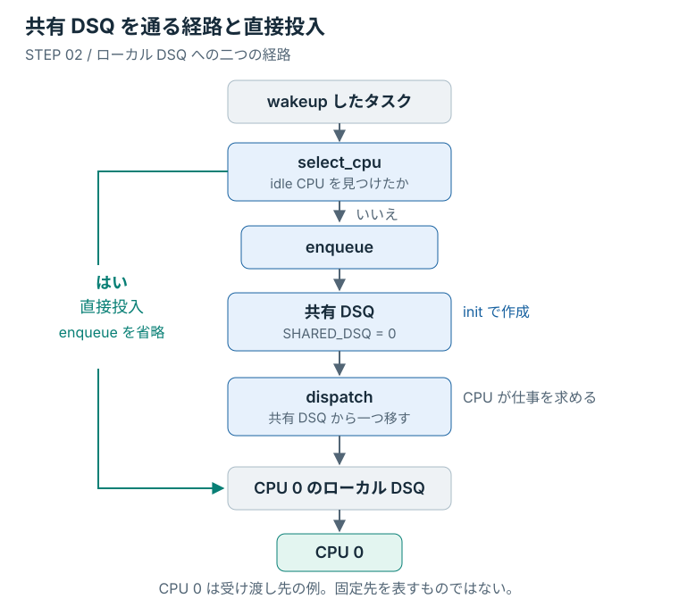

# 自分の待ち行列から取り出す

前章のコードでは、タスクをグローバル DSQ へ入れた後の取り出しを、カーネルに任せていた。
今度は、自分で用意した待ち行列から、CPU へタスクを渡す部分も書く。
並べ方は FIFO のままにして、取り出しを担当する場所を一つ増やす。

BPF 側から作成を指定する待ち行列を **独自 DSQ** と呼ぶ。
今回は複数の CPU が同じ独自 DSQ を使うので、以降は **共有 DSQ** と呼ぶ。
キュー自体はカーネルが提供し、その作成と受け渡しを自作コードで指定する。

## 共有 DSQ を作成する

編集先は `lab/src/bpf/main.bpf.c` である。
前章の loader を終了し、スライスを 20 ミリ秒へ戻して保存した状態から始める。
途中から始める場合は、残したい変更を保存してから `make restore STEP=01` で揃える。

タスクを入れる前に、共有 DSQ を作っておく。
`UEI_DEFINE(uei);` の後に次の ID を追加する。

```c
#define SHARED_DSQ 0
```

続いて、`exit` callback の前に次の関数を追加する。

```c
s32 BPF_STRUCT_OPS_SLEEPABLE(oreore_init)
{
	return scx_bpf_create_dsq(SHARED_DSQ, -1);
}
```

**`init`** はスケジューラを初期化する callback である。
この関数は、ID が `SHARED_DSQ` の待ち行列を作成する。
関数の登録は、取り出す処理と揃えて後で行う。

<details>
<summary>DSQ の ID と作成時の指定</summary>

独自 DSQ の ID は `u64` のうち `2^63` 未満から選べる。
上位ビットを使う領域は、`SCX_DSQ_GLOBAL` などの組み込み ID に予約されている。
ここでは 0 を `SHARED_DSQ` と名付けた。

`BPF_STRUCT_OPS_SLEEPABLE` は、途中で待機できる実行コンテキストの callback を定義する。
メモリ確保を伴う DSQ の作成は、この `init` に置く。
`scx_bpf_create_dsq()` の第2引数はメモリの割り当て先となる NUMA node で、-1 は特定の node を指定しない。

</details>

## 入れるだけで CPU へ届くか

`enqueue` の投入先を `SCX_DSQ_GLOBAL` から `SHARED_DSQ` に変更する。

```c
void BPF_STRUCT_OPS(oreore_enqueue, struct task_struct *p, u64 enq_flags)
{
	scx_bpf_dsq_insert(p, SHARED_DSQ, slice_ns, enq_flags);
}
```

これでタスクは独自 DSQ に入る。
CPU へ渡す処理も、これだけで揃っただろうか。

グローバル DSQ からの取り出しはカーネルに任せていた。
独自 DSQ には、取り出す処理を自分で用意する必要がある。
その役割を持つのが **`dispatch`** である。

`enqueue` の後に次の関数を追加する。

```c
void BPF_STRUCT_OPS(oreore_dispatch, s32 cpu, struct task_struct *prev)
{
	scx_bpf_dsq_move_to_local(SHARED_DSQ, 0);
}
```

CPU はローカル DSQ とグローバル DSQ に次のタスクが見つからないと、`dispatch` を呼び出す。
`scx_bpf_dsq_move_to_local()` は、共有 DSQ から呼び出し元 CPU のローカル DSQ へタスクを移す。
CPU が最後にタスクを取り出す先は、前章と同じローカル DSQ である。

最後に、ファイル末尾の `SCX_OPS_DEFINE` に次の二行を追加する。

```c
.dispatch   = (void *)oreore_dispatch,
.init       = (void *)oreore_init,
```

これで「作る」「入れる」「取り出す」が揃った。
この二行まで追加してから、端末1（ホスト側のリポジトリ直下）でロードする。

```console
make run STEP=lab MODE=partial
```

端末2から VM に入り、前章と同じ周期タスクを動かす。

```console
make vm-shell
cat /sys/kernel/sched_ext/state
cat /sys/kernel/sched_ext/root/ops
sudo /var/cache/sched-ext-tutorial/target/workload/release/sched-ext-workload \
    periodic --samples 3 --sched-ext
```

`enabled` と `oreore` で始まる名前、三つの標本を確認する。
この時点では、共有 DSQ からの取り出しを自分の `dispatch` が担当している。

確認したら、端末1で `Ctrl+C` を押す。
端末2で `cat /sys/kernel/sched_ext/state` を実行し、`disabled` に戻ったことを確かめる。
端末2は VM に入ったまま、次の変更の確認にも使う。

## 空いている CPU へ直接渡す

共有 DSQ から取り出す経路ができた。
wakeup したときに idle CPU が見つかるなら、そこへ直接タスクを渡すこともできる。

前章の `select_cpu` は、idle CPU が見つかったかを `is_idle` で受け取っていた。
次のように置き換え、その値を分岐に使う。

```c
s32 BPF_STRUCT_OPS(oreore_select_cpu, struct task_struct *p, s32 prev_cpu,
		   u64 wake_flags)
{
	bool is_idle = false;
	s32 cpu;

	cpu = scx_bpf_select_cpu_dfl(p, prev_cpu, wake_flags, &is_idle);
	if (is_idle)
		scx_bpf_dsq_insert(p, SCX_DSQ_LOCAL, slice_ns, 0);

	return cpu;
}
```

`is_idle` が真なら、戻り値の CPU のローカル DSQ へ直接投入する。
この場合、カーネルは `enqueue` を省略するので、同じタスクが共有 DSQ にも入ることはない。

idle CPU が見つからなかったときは、直接投入と共有 DSQ のどちらを通るか。
`if (is_idle)` の中を通らないため、`enqueue` が共有 DSQ へ入れ、後で `dispatch` が取り出す。
図の中央の矢印が、その経路に当たる。

<figure class="technical-figure">
<div class="diagram-scroll" tabindex="0" role="region" aria-label="図2：共有 DSQ と idle CPU への直接投入（横スクロール可能）">

</div>
<figcaption>図2：中央は共有 DSQ を通る経路、左は idle CPU への直接投入。どちらもローカル DSQ へ届く。</figcaption>
</figure>

CPU 0 は受け取り先の一例である。
共有 DSQ の経路では `dispatch` を呼んだ CPU、直接投入では `select_cpu` が返した CPU に渡る。

端末1で、変更したコードを再び起動する。

```console
make run STEP=lab MODE=partial
```

VM に入ったままの端末2で、状態と周期タスクの実行を確認する。

```console
cat /sys/kernel/sched_ext/state
sudo /var/cache/sched-ext-tutorial/target/workload/release/sched-ext-workload \
    periodic --samples 3 --sched-ext
```

三つの標本を確認したら、端末1で `Ctrl+C` を押す。
端末2で解除を確認し、ホスト側へ戻る。

```console
cat /sys/kernel/sched_ext/state
exit
```

この出力だけでは、各タスクが直接投入と共有 DSQ のどちらを通ったかまでは分からない。
分岐はコードと図で、変更後もタスクが実行できることは出力で確かめる。

## 三種類の DSQ の役割

使った待ち行列を並べると、作成と取り出しの担当が整理できる。

| DSQ | 誰が用意するか | 本編での取り出し |
|---|---|---|
| ローカル DSQ | カーネル | その CPU が実行する |
| グローバル DSQ | カーネル | カーネルがローカル DSQ へ渡す |
| 独自 DSQ | 自作コードがカーネルへ作成を依頼する | 自作の `dispatch` がローカル DSQ へ渡す |

今のコードは、独自 DSQ を一つ共有し、FIFO で取り出す。
CPU 時間の割り当てを変えた前章に続いて、タスクを取り出す処理も自分で指定できた。

完成例と比べたい場合は、ホスト側で次の差分を読む。

```console
diff -u checkpoints/step-02-shared-dsq/src/bpf/main.bpf.c lab/src/bpf/main.bpf.c
```

空白や関数の配置が違っていてもよい。
DSQ の ID、三つの scheduling callback、`init`、ops への登録を照合する。
本編以外の経路と callback の条件は、Linux 7.0 の [Scheduling Cycle](https://docs.kernel.org/7.0/scheduler/sched-ext.html#scheduling-cycle) で確認できる。
