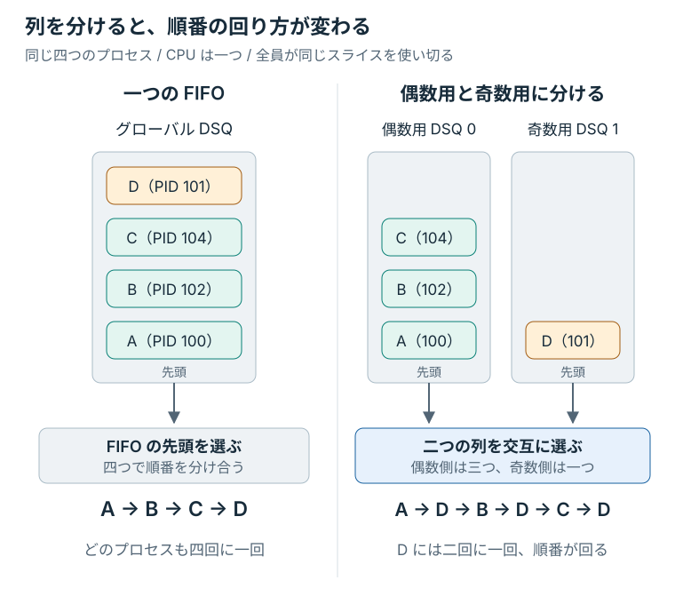
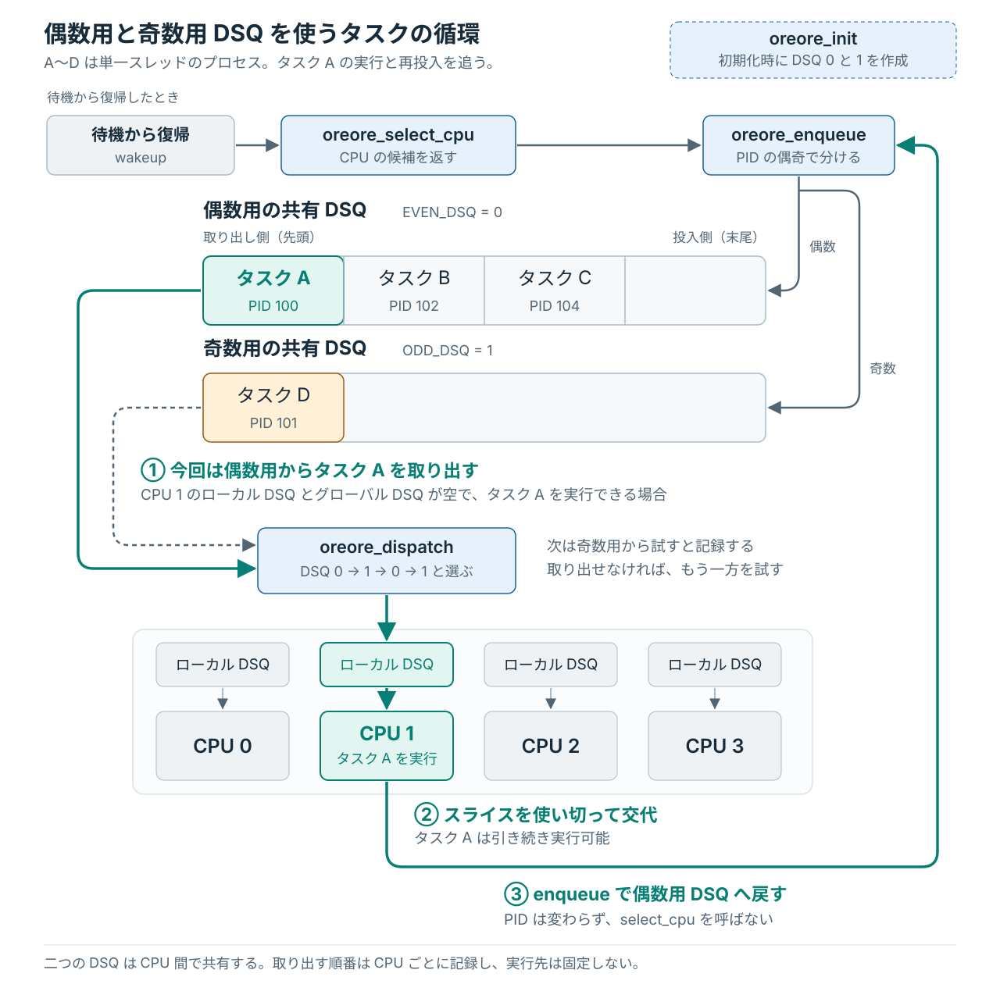

# 自分の待ち行列から取り出す

前の課題では、一つのグローバル DSQ を使い、タスクごとのスライスを変えて進む速さに差を付けた。
今回はスライスを同じ 10 ミリ秒に揃え、待ち行列の分け方で CPU 時間の配分を変える。

プロセス番号が偶数なら DSQ 0、奇数なら DSQ 1 に入れ、二つの列へ交互に順番を回す。
誰と同じ列に入るかによって、各プロセスが受け取る CPU 時間がどう変わるかを測る。

## 待ち行列を分ける理由

一つの FIFO に四つのタスクを並べると、それぞれに順番が回る。
これを三つと一つの二列に分け、列を交互に選ぶと、三つのタスクは自分たちの列に来た順番を分け合い、もう一方の一つはその列の順番を独占できる。
各タスクに同じスライスを割り当てても、列の分け方によって CPU 時間に差が付く。

この方針を実装するため、BPF 側からカーネルへ二つの待ち行列の作成を依頼する。
BPF スケジューラが作成する待ち行列を **独自 DSQ** と呼ぶ。
キューのデータ構造と出し入れの関数はカーネルが提供するので、自作コードではタスクの投入先と、取り出す列を決める。

今回は、プロセス番号（**PID**）の偶奇で振り分ける。
偶奇は処理内容とは関係しないが、番号を見れば投入先を予想できる。
後で応答用と計算用などに分ける場合も、同じ場所に分類の条件を書く。

<figure class="technical-figure">
<div class="diagram-scroll" tabindex="0" role="region" aria-label="一つの FIFO と偶奇で分けた二つの DSQ の比較（横スクロール可能）">

</div>
<figcaption>四つとも CPU を使い続け、同じスライスを使い切る場合の比較。CPU は一つに揃える。</figcaption>
</figure>

DSQ 0 と DSQ 1 は、どちらも複数の CPU から取り出せる **共有 DSQ** として使う。
0 と 1 は待ち行列の ID であり、実行先の CPU 番号ではない。
列の中は FIFO のままにし、どちらの列から取り出すかを自作コードで決める。

## 二つの DSQ で使う callback を登録する

グローバル DSQ を使う実装では、カーネルがタスクをローカル DSQ へ移していた。
独自 DSQ では、自作コードが取り出す列を選び、ローカル DSQ へ移す関数を呼ぶ必要がある。

そこで、二つの callback を追加する。
スケジューラの初期化時に呼ばれる **`init`** で DSQ を作り、CPU が次のタスクを求めるときに呼ばれる **`dispatch`** で取り出す。

編集先は `lab/src/bpf/main.bpf.c` である。
loader が動いていれば先に終了する。**
前の課題で加えた変更を別のファイルなどへ保存してから、`make restore STEP=03` で開始状態を揃える。**
この状態では、名前によるスライスの変更はなく、すべてのタスクに同じ 10 ミリ秒を割り当てる。

ファイル末尾の `SCX_OPS_DEFINE` に `.dispatch` と `.init` の二行を加え、次の形にする。

```c
SCX_OPS_DEFINE(oreore_ops,
	       .select_cpu = (void *)oreore_select_cpu,
	       .enqueue    = (void *)oreore_enqueue,
	       .dispatch   = (void *)oreore_dispatch,
	       .init       = (void *)oreore_init,
	       .exit       = (void *)oreore_exit,
	       .timeout_ms = 5000,
	       .name       = "oreore");
```

`.init` には DSQ を作る `oreore_init`、`.dispatch` には取り出す列を選ぶ `oreore_dispatch` を登録した。
変更後の役割は、次のようになる。

| callback | 呼ばれる場面の例 | 今回のコードがすること |
|---|---|---|
| `init` | スケジューラを初期化するとき | 偶数用と奇数用の DSQ を作成する |
| `select_cpu` | 待機から復帰したタスクなどの CPU 候補を選ぶとき | 前章と同じく CPU の候補を返す |
| `enqueue` | タスクを実行待ちの列へ入れるとき | PID の偶奇で投入先を選ぶ |
| `dispatch` | ローカル DSQ とグローバル DSQ に実行できるタスクが見つからないとき | 二つの列を交互に選び、ローカル DSQ へ移す |
| `exit` | スケジューラが終了するとき | 前章と同じく終了理由を記録する |

まだロードせず、以下の手順で新しい二つの関数を定義し、`oreore_enqueue` の投入先も変更する。

## oreore_init で二つの DSQ を作成する

タスクを投入する前に、`oreore_init` で二つの DSQ を作る。
作成時と投入時に同じ列を指定できるよう、それぞれの ID に名前を付ける。
`UEI_DEFINE(uei);` の後に、次の定義を追加する。

```c
#define EVEN_DSQ 0
#define ODD_DSQ 1
```

続いて、`oreore_exit` の前に次の関数を追加する。

```c
s32 BPF_STRUCT_OPS_SLEEPABLE(oreore_init)
{
	s32 err;

	err = scx_bpf_create_dsq(EVEN_DSQ, -1);
	if (err)
		return err;
	return scx_bpf_create_dsq(ODD_DSQ, -1);
}
```

`scx_bpf_create_dsq()` は、指定した ID の待ち行列をカーネルに作成させる関数で、成功すると 0、失敗すると負のエラー値を返す。
どちらか一方でも作成に失敗したらエラー値をカーネルへ返し、必要な DSQ が揃わないままスケジューラが動き始めるのを防ぐ。

DSQ の作成にはメモリ確保を伴うため、途中で待機できる実行コンテキストの `init` に置く。
`BPF_STRUCT_OPS_SLEEPABLE` は、このような callback を定義するマクロである。

<details>
<summary>DSQ の ID と作成時の指定</summary>

独自 DSQ の ID は、`u64` のうち `2^63` 未満から選べる。
上位ビットを使う領域は、`SCX_DSQ_GLOBAL` などの組み込み ID に予約されている。
ここでは、0 を `EVEN_DSQ`、1 を `ODD_DSQ` と名付けた。

`scx_bpf_create_dsq()` の第2引数は、メモリの割り当て先となる NUMA node である。
-1 は、特定の node を指定しないことを表す。

</details>

## oreore_enqueue で偶数用と奇数用に振り分ける

`oreore_enqueue` の投入先を、グローバル DSQ から、プロセス番号の偶奇に対応する独自 DSQ へ変える。

```c
void BPF_STRUCT_OPS(oreore_enqueue, struct task_struct *p, u64 enq_flags)
{
	u64 dsq = (p->tgid % 2 == 0) ? EVEN_DSQ : ODD_DSQ;

	scx_bpf_dsq_insert(p, dsq, slice_ns, enq_flags);
}
```

分類には `p->tgid` を使う。
Linux のタスクはスレッドに対応し、`p->pid` はスレッド自身の番号、`p->tgid` はそのタスクが属するプロセスの番号を表す。
`pid` で分けると同じプロセスのスレッドが別の列に入る可能性があるが、`tgid` ならプロセス単位で同じ列に揃えられる。
[^task-id]

偶数なら `EVEN_DSQ`、奇数なら `ODD_DSQ` を、`scx_bpf_dsq_insert()` の第2引数に渡す。
変更するのは投入先だけで、`slice_ns` と `enq_flags` は完成例 `STEP=03` の値を使う。

すべてのタスクをこの分類に通すため、`oreore_select_cpu` は CPU の候補を返すだけの実装にしておく。
`select_cpu` からローカル DSQ へ直接投入すると、`enqueue` が省略され、偶奇の振り分けを通らなくなる。
idle CPU が見つかった場合も、投入は `enqueue` に任せる。
[^scheduling-cycle]

## oreore_dispatch で二つの列を交互に選ぶ

CPU のローカル DSQ とグローバル DSQ に実行できるタスクが見つからないと、カーネルは `oreore_dispatch` を呼ぶ。
ここで毎回偶数用から取り出すと、偶数用が空にならない間は奇数用を選べない。
交互に選ぶには、次にどちらを試すかを記録する必要がある。

### CPU ごとに次の順番を記録する

キーと値を保存できる **BPF map** を使い、CPU ごとに「次に先に試す DSQ の ID」を保持する。
`EVEN_DSQ` と `ODD_DSQ` の定義の後に、次を追加する。

```c
struct {
	__uint(type, BPF_MAP_TYPE_PERCPU_ARRAY);
	__uint(max_entries, 1);
	__type(key, u32);
	__type(value, u32);
} dispatch_turn SEC(".maps");
```

`BPF_MAP_TYPE_PERCPU_ARRAY` は、CPU ごとに別の値を持つ配列である。
ここでは要素数を一つにして、各 CPU が自分用のキー 0 の値を持つようにする。
キーで CPU を指定するのではなく、同じキー 0 にアクセスしても、呼び出し元 CPU の値を読み書きする。

値は作成時に 0 で初期化されるため、各 CPU は偶数用の DSQ から試し始める。[^per-cpu-map]
CPU 0 が順番を更新しても、CPU 1 の順番は変わらない。
この実装の「交互」は各 CPU が取り出す順番を指すので、実験では CPU を一つに揃え、その順番と配分を観察する。

### 取り出せた列の反対を次の候補にする

`oreore_enqueue` の後に、次の関数を追加する。

```c
void BPF_STRUCT_OPS(oreore_dispatch, s32 cpu, struct task_struct *prev)
{
	u32 key = 0;
	u32 *turn = bpf_map_lookup_elem(&dispatch_turn, &key);
	u64 dsq;

	if (!turn)
		return;

	dsq = *turn;
	if (!scx_bpf_dsq_move_to_local(dsq, 0)) {
		dsq ^= 1;
		if (!scx_bpf_dsq_move_to_local(dsq, 0))
			return;
	}
	*turn = dsq ^ 1;
}
```

`scx_bpf_dsq_move_to_local()` は、指定した DSQ から、呼び出し元 CPU のローカル DSQ へタスクを移し、成功したかを返す。
まず map に保存した ID の列を試し、空の場合や、その CPU で実行できるタスクが見つからない場合は、もう一方を試す。

移動できた列の反対を、次に先に試す候補として保存する。
両方に実行できるタスクがあれば 0、1、0、1 と選び、片方が空なら、タスクがある側から取り出せる。

次の候補の読み書きには、`bpf_map_lookup_elem()` が返すポインタを使う。
このポインタは、呼び出し元 CPU が持つキー 0 の値を指す。
`if (!turn)` で取得に失敗していないか確認してから参照し、DSQ の ID は `^ 1` で 0 と 1 を切り替えている。

独自 DSQ を使っても、CPU が最後にタスクを取り出す先はローカル DSQ である。
投入から実行、再投入までの関係は次のようになる。

<figure class="technical-figure">
<div class="diagram-scroll" tabindex="0" role="region" aria-label="偶数用と奇数用の共有 DSQ を使うタスクの循環（横スクロール可能）">

</div>
<figcaption>DSQ 0 と DSQ 1 はどちらも各 CPU から取り出せる。図の CPU 1 は実行先の一例である。</figcaption>
</figure>

スライスを使い切って交代した後も実行可能なら、前章と同じく `enqueue` で列へ戻る。
この再投入は `select_cpu` を通らず、同じ PID の偶奇によって再び分類される。

## 変更したスケジューラを動かす

編集を保存し、端末1（ホスト側のリポジトリ直下）でロードする。

```console
make run STEP=lab MODE=partial
```

端末2から VM に入り、最初の起動確認と同じ周期タスクを動かす。

```console
make vm-shell
cat /sys/kernel/sched_ext/state
cat /sys/kernel/sched_ext/root/ops
sudo /var/cache/sched-ext-tutorial/target/workload/release/sched-ext-workload \
    periodic --samples 3 --sched-ext
```

`enabled` と `oreore` で始まる名前、三つの標本が出ることを確認する。
周期タスクが一つでも完了すれば、片方の列にしかタスクがない場合に実行を進められることが分かる。
ただし、この出力だけでは、二つの列へ交互に順番が回ることまでは確認できない。

確認が終わったら、端末1で `Ctrl+C` を押す。
端末2で解除を確認してから、ホスト側へ戻る。

```console
cat /sys/kernel/sched_ext/state
exit
```

## 偶数を三つ、奇数を一つ動かす

次に、二つの列で人数を変え、各プロセスが受け取った CPU 時間を比較する。
補助スクリプトが偶数 PID を三つ、奇数 PID を一つ揃え、すべてを CPU 0 で動かす。
各プロセスは単一スレッドで同じ計算を続け、スライスを使い切る。

まず、全員に同じ 10 ミリ秒のスライスを割り当てる一つの FIFO で測る。
スケジューラを停止した状態から、ホスト側のリポジトリ直下で実行する。

```console
make bench CASE=dsq STEP=03
```

続いて、変更した lab を同じ条件で測る。

```console
make bench CASE=dsq STEP=lab
```

このコマンドは、指定したスケジューラを partial mode で起動し、準備ができた四つのプロセスを 10 秒間測定する。
終了時にはスケジューラも解除する。
完成例と比較する場合は、`STEP=lab` を `STEP=04` に変える。

PID は起動ごとに変わるが、偶数三つと奇数一つという人数は揃える。
以前の実験の `SCHED_EXT` タスクが同じ CPU に残っていると、混入を検出して測定を中止する。
表示されたタスクを、その実験の端末で終了してから測り直す。

出力の `cpu_ms` は、測定区間に各プロセスが使った CPU 時間である。
`/proc/<PID>/schedstat` にある累積実行時間の差分から求めている。[^cpu-runtime]
`share_percent` は、四つのプロセスの CPU 時間の合計に占める割合であり、待っていた時間や、ほかのプロセスが使った時間は分母に含まない。
末尾の `scheduler_state_after=disabled` で、解除も確認する。

| 方針 | 偶数側の各プロセス | 奇数側の一つ | 同じ長さのスライスを交互に渡した場合の考え方 |
|---|---|---|---|
| 一つの FIFO | 約 25% | 約 25% | 四つで順番を分け合う |
| 二つの DSQ を交互に選ぶ | 約 16.7% | 約 50% | 各列に半分ずつ、偶数側は三つで分け合う |

この表は配分の目安である。
割り込みや、ほかのタスクとの交代、VM の実行状況などによって実測値はずれるため、自分の出力でも奇数側の一つと偶数側の各プロセスの割合を比べる。

2026年9月9日に教材 VM の CPU 0 で測ったところ、一つの FIFO では各プロセスが 24.9〜25.1% を受け取った。
二つの DSQ では、偶数側がそれぞれ 16.6%、16.7%、16.7%、奇数側が 50.0% になった。
条件と出力は、[一つの FIFO の記録](../measurements/2026-09-09/dsq-global.txt)と[二つの DSQ の記録](../measurements/2026-09-09/dsq-parity.txt)に残している。

偶数側では、自分の列に三回順番が来て、ようやく各プロセスが一回ずつ実行される。
列へ同じ回数だけ順番を回しても、プロセスごとの CPU 時間は等しくならない。
独自 DSQ の分類条件と取り出す順番によって、誰と CPU 時間を分け合うかを決められる。

## 完成例と照合する

ホスト側で、完成例との差分を確認する。

```console
diff -u checkpoints/step-04-shared-dsq/src/bpf/main.bpf.c lab/src/bpf/main.bpf.c
```

空白や関数の配置が違っていてもよい。
二つの DSQ の ID、`dispatch_turn`、`init`、`enqueue`、`dispatch`、ops への登録を照合する。
`select_cpu` は、前章の CPU の候補を返す実装のままである。

[^task-id]: Linux 7.0 の [`task_struct` と PID の定義](https://github.com/torvalds/linux/blob/v7.0/include/linux/sched.h)では、`pid` と `tgid` を区別している。
    ここでは教材 VM の PID 名前空間で動かし、コンテナ内の PID は扱わない。

[^per-cpu-map]: [BPF_MAP_TYPE_ARRAY and BPF_MAP_TYPE_PERCPU_ARRAY](https://docs.kernel.org/bpf/map_array.html) に、作成時のゼロ初期化と、呼び出し元 CPU の要素を読み書きする仕組みが記載されている。

[^scheduling-cycle]: 直接投入による `enqueue` の省略と、`dispatch` の呼び出し条件は Linux 7.0 の [Scheduling Cycle](https://docs.kernel.org/7.0/scheduler/sched-ext.html#scheduling-cycle) で確認できる。

[^cpu-runtime]: [Scheduler Statistics](https://docs.kernel.org/scheduler/sched-stats.html) に、`/proc/<PID>/schedstat` の先頭の値がナノ秒単位の CPU 実行時間であると記載されている。
