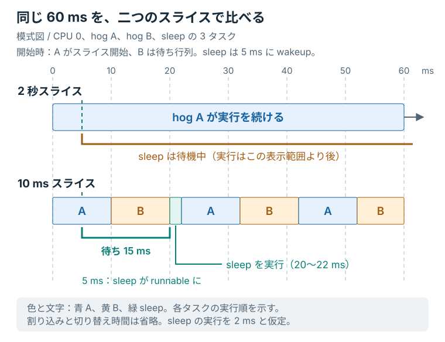

# スライスを短くする

2 秒のスライスでは、periodic が CPU を使うまでに数秒待つことがあった。
同じ FIFO でも、A と B が早く交代すれば、periodic にも早く順番が回りそうである。
三つのタスクと共有 DSQ はそのままに、スライスを 10 ミリ秒へ縮める。

## 待ち時間と切り替え回数

一回に CPU を使う時間が短くなったら、待ち時間と切り替え回数はそれぞれどうなるか。
「待ち時間は短く、切り替えは多く」と「両方とも少なく」のどちらになりそうだろうか。

同じタスク同士が短い間隔で交代するので、待ち時間を減らす一方で、切り替えの機会は増える。
前章のモデルでは最大 2 スライス分を待った。
10 ミリ秒なら約 20 ミリ秒になるが、これは runnable 後の待ちを単純化した値で、`late_ms` の上限ではない。

## lab のスライスを 10 ミリ秒にする

`lab/src/bpf/main.bpf.c` の `slice_ns` を次の値へ変更する。
途中から始める場合は、残したい変更を保存してから `make restore STEP=03` で長いスライスの状態へ戻せる。

```c
const volatile u64 slice_ns = 10000000ULL;  /* 10 milliseconds */
```

変更したファイルを保存する。
ホスト側のリポジトリ直下で同じ 15 標本の実験を行い、ログを保存する。
前章の `make bench` は終了時にスケジューラを外している。
別途 `make run` を使っていた場合は、先に終了して VM 内の `state` が `disabled` であることを確認する。

```console
mkdir -p target/measurements
make bench CASE=step STEP=lab 2>&1 | tee target/measurements/short.log
```

完成例なら `STEP=04` でも測定できる。
自分で保存したコードを測る場合は、`STEP=lab` を使う。

## 二つの数値を比べる

前章で見つけた `max_late_ms` と、ログ末尾の `context-switches` を比べる。
最大遅延は「減った」「変わらなかった」「増えた」のどれか。
切り替え回数も、同じ三つから選んでみる。

三つのログから、次の欄へ数値を移す。
`deadline_misses` は、100 ミリ秒の許容を超えた標本数である。

| 条件 | 最大遅延（ms） | deadline miss | context switches（回） |
|---|---:|---:|---:|
| fair class |  |  |  |
| 2 秒スライス |  |  |  |
| 10 ミリ秒スライス |  |  |  |

まずは自分の数字を使い、次の文の選択肢を一つずつ選べばよい。

> スライスを 2 秒から 10 ミリ秒へ変えた。<br>
> 最大遅延は［減った／変わらなかった／増えた］。<br>
> 切り替え回数は［減った／変わらなかった／増えた］。

測定日とホストの負荷状況もログと一緒に残す。
結果が予想と違っても、数値を見本に合わせる必要はない。

## 一回の実測との比較

前章と同じ教材 VM で続けて測った一回の結果は、次のようになった。
[短いスライスの全標本と測定条件](../measurements/2026-09-06/short.txt)も参照できる。

| 条件 | 最大遅延（ms） | deadline miss | context switches（回） |
|---|---:|---:|---:|
| fair class | 1.686 | 0 / 15 | 5,167 |
| 2 秒スライス | 3,468.367 | 15 / 15 | 177 |
| 10 ミリ秒スライス | 21.272 | 0 / 15 | 1,546 |

この試行では、2 秒と比べて最大遅延が減り、切り替え回数は増えた。
fair class はキューの方針も異なるので、三条件を「切り替え回数が少ないほどよい」と順位付けはしない。
スライス変更の影響を見るときは、まず同じ FIFO の長短二条件を比べる。

## 図で実行順を確かめる

同じ 60 ミリ秒を上下に並べる。
A がスライスを開始した直後に B はすでに待っており、periodic は 5 ミリ秒で runnable になると仮定する。

<figure class="technical-figure">
<div class="diagram-scroll" tabindex="0" role="region" aria-label="図5：同じ時間幅で見る長いスライスと短いスライス（横スクロール可能）">

</div>
<figcaption>図5：同じ時間幅で比較。短いスライスでは A と B が早く交代し、periodic に順番が回る。</figcaption>
</figure>

上の行では A が実行を続けたまま、図の表示範囲が終わる。
下の行では A と B の後、20 ミリ秒の時点で periodic が動く。
periodic は 5 ミリ秒で runnable になったので、この例の待ち時間は 15 ミリ秒である。

図は、periodic の実行時間を説明用に 2 ミリ秒と置き、割り込みと切り替え時間を省略している。
先ほどの実測表の再現ではなく、順番が早く回る理由を示したモデルである。

自分の表でも待ち時間が減っていれば、「A と B を早く選び直す」という説明と整合する。
差がない場合や逆の結果なら、[CPU 固定、タスク数、適用中のスケジューラ](../appendix/troubleshooting.md#実験で遅延が見えない)を確認する。
測定が hog の終了後まで延びていないか、ログ末尾だけ遅れが小さくなっていないかも見る。
同じ条件で繰り返せば、一回だけの外れ値と、繰り返し現れる傾向を区別しやすくなる。

切り替え回数が増えたことだけから、切り替えコストが何ミリ秒増えたかは分からない。
同じ時間で完了した仕事量を表す **throughput** への影響を知るには、別に仕事量を測る必要がある。
実測から言えるのは、まず自分の表で確認した二つの値の変化である。

<details>
<summary>もう一つ試すなら、50 ミリ秒</summary>

10 ミリ秒と 2 秒の間にある値として、50 ミリ秒を試せる。
`slice_ns` を次の値へ変更し、保存する。

```c
const volatile u64 slice_ns = 50000000ULL;  /* 50 ms */
```

二つの hog が先行するモデルなら、runnable 後の待ちは最大約 100 ミリ秒になる。
10 ミリ秒より待ちが長くなりうる一方、hog 同士の切り替えは減ると予想できる。

```console
make bench CASE=step STEP=lab 2>&1 | tee target/measurements/medium.log
```

許容値も 100 ミリ秒だが、`late_ms` はモデル外の遅れを含むので、deadline miss が必ずゼロになるとは言えない。
実験が終わったら、`slice_ns` を `10000000ULL`、コメントを `10 milliseconds` に戻して保存する。

</details>

同じコードの一つの値を変え、待ち時間と切り替え回数を比べられた。
「短いほうがよい」と一括りにする前に、自分の表で何が減り、何が増えたかを指せるようになっている。
