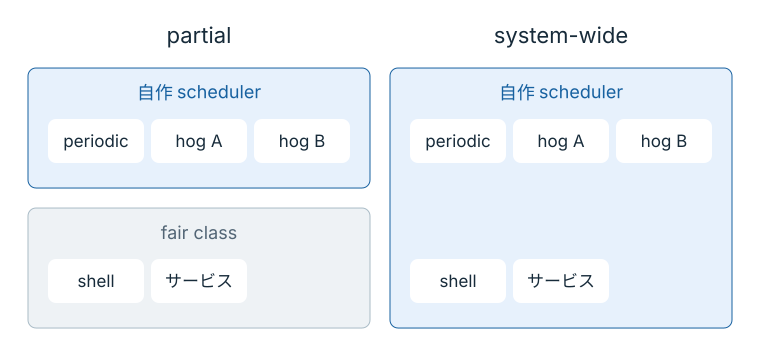

# VM 全体へ広げる

ここまでは、明示的に指定した実験用タスクだけが自作スケジューラの対象だった。
実験用のタスクに 10 ミリ秒で順番を回せても、shell やコンパイラまで同じ方針で動かしたときの使い勝手は、まだ確かめていない。
今度はコードの代わりに、適用する範囲を変える。

## 新たに対象になるタスク

partial mode の図で、shell が入っている枠を探す。
system-wide mode にすると、同じ shell はどの枠へ入るだろうか。

<figure class="technical-figure">
<div class="diagram-scroll" tabindex="0" role="region" aria-label="partial mode と system-wide mode の適用範囲（横スクロール可能）">

</div>
<figcaption>同じタスクを左右で比較。リアルタイムクラスなど、sched_ext の対象外は省略している。</figcaption>
</figure>

shell も自作スケジューラの枠へ入る。
コンパイラや通常のバックグラウンドサービスも対象になり、自作の方針が操作感へ影響する。
入力を待っていた shell には早く応答してほしい一方、コンパイラには計算を進めてほしい。
同じ FIFO で、違う要求を持つタスクを扱うことになる。

## 10 ミリ秒の方針で操作する

前章の実験が終了していることを確認する。
ここでは条件を揃えるため、10 ミリ秒の完成例である `STEP=04` を使う。
lab を上書きする操作は必要ない。

端末1（Mac 側のリポジトリ直下）で起動する。

```console
make run STEP=04 MODE=system
```

`MODE=system` が、対象を VM 内の通常タスクへ広げる指定である。
端末2から VM に入り、スケジューラ名を確認する。

```console
make vm-shell
cat /sys/kernel/sched_ext/root/ops
uname -a
```

名前が `oreore` で始まることと、コマンドの出力が返ることを確かめる。
そのまま短いコマンドをいくつか実行し、入力から出力までに引っかかりを感じるかを見てみる。

コマンドが一度動いただけでは、負荷が高くても快適に使えるとは判断できない。
ここで確認できたのは、操作している shell まで自作の方針で動かせたことである。
数値で評価するなら、入力への応答時間、ビルドにかかった時間、throughput などを別々に測る。

## 元へ戻す

端末1で `Ctrl+C` を押し、端末2で状態を確認する。

```console
cat /sys/kernel/sched_ext/state
exit
```

`disabled` に戻れば解除できている。
操作できない場合に限り、Mac 側の別の端末から `make reset` を実行する。

スライスの値だけでなく、誰を対象にするかも実験条件になった。
sleep から戻るまでの時間を測った表と、shell を実際に操作した印象は、別の記録として残しておく。
