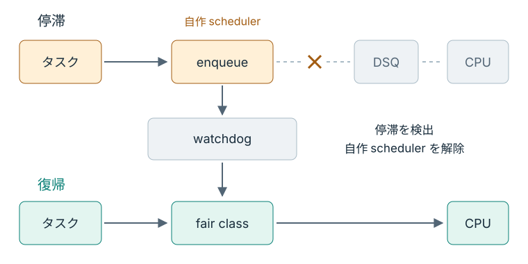

# 壊して、戻る

system-wide mode では、操作や修復に使う shell も自作スケジューラに従う。
そのスケジューラがタスクを CPU へ渡さなくなると、shell 自身も動けなくなる。
最後は、あらかじめ用意した壊れた完成例で、カーネルによる復帰を確かめる。

## どの矢印がなくなるか

これまでの `enqueue` は、受け取ったタスクを DSQ に入れていた。
最後の完成例は、その処理を取り除いている。

```c
void BPF_STRUCT_OPS(oreore_enqueue, struct task_struct *p, u64 enq_flags)
{
	/* Intentionally drop every runnable task for the watchdog exercise. */
	(void)p;
	(void)enq_flags;
}
```

このタスクは、共有 DSQ へ進むか、それとも渡されないまま待つか。
投入する呼び出しがないので、どの DSQ にも進まない。
この完成例には後から取り出す経路もなく、タスクは CPU を待ち続ける。

`enqueue` で直ちに DSQ へ入れないこと自体は、API の違反ではない。
BPF 側でタスクを保持し、後から `dispatch` で渡す実装も認められている。
この完成例の問題は、その後の経路もなくタスクを放置することにある。

## ロード後に停滞を見つける仕組み

BPF verifier は、ロード時にプログラムがカーネル内で許されない動作をしないか検査する。
検査を通っても、スケジューラとしてタスクを進められるとは限らない。
実行中に runnable task の停滞を検出するのが、カーネルの watchdog である。

<figure class="technical-figure">
<div class="diagram-scroll" tabindex="0" role="region" aria-label="watchdog が壊れた scheduler から復帰させる流れ（横スクロール可能）">

</div>
<figcaption>× はタスクを DSQ へ渡す経路の欠落。watchdog が検出すると、自作 scheduler が外れる。</figcaption>
</figure>

watchdog は異常を検出すると自作スケジューラを外し、対象のタスクを fair class へ戻す。
この `oreore_broken` は、`sched_ext_ops` の `timeout_ms` を 3 秒に設定している。
教材の環境では数秒での復帰を期待するが、3 秒以内に VM が必ず応答を再開する保証ではない。
ホストが VM を実行しない時間なども、実際の待ち時間へ影響する。

## 故障を実行する

この操作は教材 VM の中で行われる。
`MODE=system` なので shell や通常のサービスも対象となり、watchdog が動くまでの数秒間、端末の応答が止まることを見込んでおく。
リアルタイムクラスなど、`sched_ext` の対象外のタスクまで止める実験ではない。

前章のスケジューラが `disabled` に戻った状態から、端末1（ホスト側のリポジトリ直下）で起動する。
`STEP=05` は壊れた完成例を使う指定で、lab のコードは変更しない。

```console
make run STEP=05 MODE=system
```

応答が止まったら復帰を待つ。
自動復帰しない場合は、ホスト側の別の端末から次を実行する。

```console
make reset
```

## 復帰した証拠を読む

端末が動き始めたら、状態と停止理由の二つを読む。
端末2から VM に入り、状態を確認する。

```console
make vm-shell
cat /sys/kernel/sched_ext/state
```

`disabled` に戻っていれば、自作スケジューラは外れている。
続いて、端末1に表示された停止理由を見る。

2026 年 9 月 6 日の教材 VM では、次の出力があり、`state` は `disabled` に戻った。

```text
Error: EXIT: runnable task stall (watchdog failed to check in for 3.001s)
make: *** [run] Error 1
```

ここで停滞の検出を示すのは、`runnable task stall` と `Error 1` のどちらだろうか。
理由が分かるのは `runnable task stall` のほうである。
`Error 1` は異常停止を loader がエラーとして報告した結果で、それだけでは復帰の成否は分からない。

自分の出力でも、stall の報告と `disabled` の組み合わせを確認する。
手動で `make reset` した場合は、自動復帰を確認した記録と分けておく。
確認後は端末2で `exit` を実行し、ホスト側へ戻る。

<details>
<summary>停止理由が loader へ届くまで</summary>

[一行変えて動かす](./model.md)で読んだ `exit` callback は、スケジューラが外れた理由を `UEI_RECORD` で記録する。
loader 側の **`uei_report`** が、その exit 情報を人間が読める形で出力する。

タスクを後で渡すための保持方法は、Linux 7.0 の [Scheduling Cycle](https://docs.kernel.org/7.0/scheduler/sched-ext.html#scheduling-cycle) に記載されている。

</details>

同じ `disabled` への復帰でも、`Ctrl+C` で止めた場合と watchdog が止めた場合では、停止理由が違う。
状態だけでなく理由も読めれば、自作スケジューラの終了を見分けられる。
