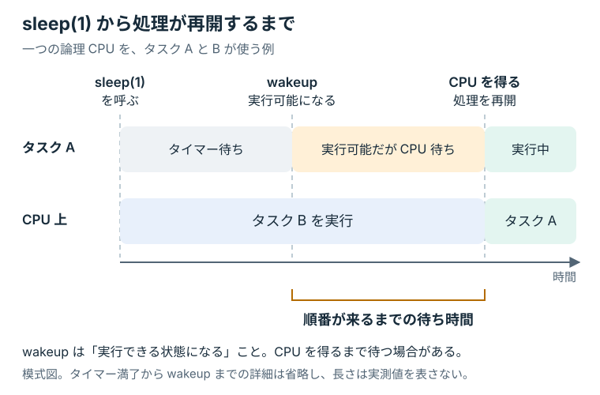
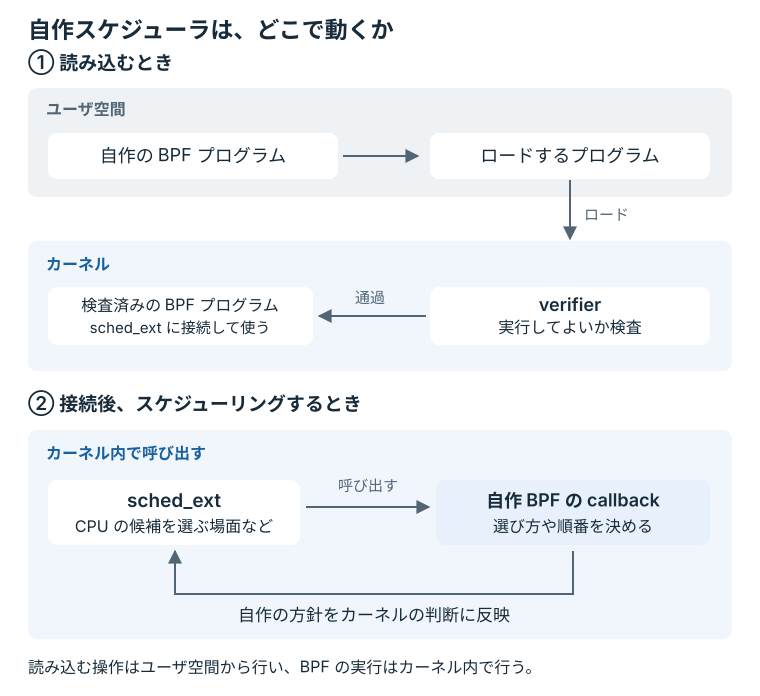

# はじめに

実行可能になったプロセスが、すぐに CPU 上で動き始められるとは限らない。
一つの論理 CPU で同時に実行できるタスクは一つであり、複数のタスクが実行を求めると、スケジューラが順番を決める。
処理が「いつ再開されるか」には、この待ち時間も影響する。

タスクが I/O やタイマーを待っている間は、CPU を必要としない待ち状態にある。
待っていた条件が満たされると、タスクは再び実行可能になる。
この状態変化を Linux のスケジューリングでは **wakeup** と呼ぶ。

この原則を最も分かりやすく観測できるのが、`sleep(1)` を呼び出したプロセスである。
タイマーが満了すればプロセスは実行可能になるが、その時点で CPU を別のタスクが長く使っていれば、再開はさらに先へ延びる。
普段の Linux ではこの遅れは小さい。
しかし、スケジューラ側の判断を変えれば、同じ `sleep(1)` の遅れを意図的に大きくできる。

<figure class="technical-figure">

<figcaption>wakeup と処理再開の違い。黄色の区間が、実行可能になってから CPU を待つ時間に当たる。狭い画面では図を横にスクロールできる。</figcaption>
</figure>

その判断を自分の手で書くために使うのが、Linux の **`sched_ext`** である。
`sched_ext` は、BPF で記述した CPU スケジューラを実行時にカーネルへ読み込む仕組みである。
カーネルを変更して再起動しなくても、タスクをどの順番で、どの CPU で、どれだけの時間動かすかを差し替えられる。

## ユーザ空間からカーネルの判断に差し込む

`sched_ext` へ渡すプログラムには、カーネル内部で動かすための形式と制約がある。
その仕組みが **BPF** であり、ユーザ空間のプログラムからカーネルへロードできる。
カーネルのソースコードそのものを書き換えるのではなく、カーネルがあらかじめ用意した場所へ処理を差し込み、その場所で起きる判断に参加できる。

ただし、ユーザ空間で書いたコードが、そのまま好き勝手にカーネル内部を操作できるわけではない。
BPF プログラムをロードすると、まずカーネルの **verifier** が、そのプログラムを実行してよいか検査する。
ロードされたプログラムが使える機能も、program type や実行される場所に応じて制限されている。
検査を通過したプログラムだけがカーネル側で実行され、許可された helper や kfunc を通してカーネルの状態を参照したり、判断に影響を与えたりできる。

`sched_ext` では、CPU の候補を選ぶときや、次に実行するタスクを求めるときに、このプログラムが呼ばれる。
このように、決められたタイミングで呼ばれる関数を **callback** と呼ぶ。
自分で書いた数行が実際のスケジューリング経路に入り、周期タスクの再開時刻へ影響する。

<figure class="technical-figure">

<figcaption>BPF のロードと実行の場所。verifier によるロード時の検査と、接続後の callback の呼び出しは、別の段階で行われる。</figcaption>
</figure>

このハンズオンでは、タスクを到着順に扱う **FIFO** スケジューラをロードし、1秒周期のタスクを意図的に遅らせる。
次にタイムスライスを短くして、遅延とコンテキストスイッチ数がどう動くかを観測する。
最後に、タスクを意図的に放置する壊れたスケジューラをロードし、カーネルの watchdog がどう回収するかを見る。

## 想定する読者

次の知識を前提とする。

- C と Rust のコードを読んだ経験がある
- Linux のコマンドラインを操作できる
- 一つの CPU コアが同時に実行できるタスクは一つであり、コンテキストスイッチによって並行に見せていると理解している

BPF、カーネル開発、スケジューラの実装経験は前提にしない。
前提としない用語は、必要になる章の中で説明する。

## この本で扱わないこと

この本で作るのは、ごく単純な FIFO scheduler である。
公平性、優先度、NUMA、キャッシュ局所性まで一度に扱うのではなく、まず「一つの設計変更が、どの観測値を動かしたのか」を説明できる条件を作る。

そのため、本編では次の主題を意図的に扱わない。

- 重みに基づく公平な CPU 時間の分配
- 優先度や preemption を含む本格的な scheduling policy
- キャッシュや NUMA を前提としたマルチコア最適化

これらは実用的な scheduler では避けて通れない論点である。
しかし、最初から複数の要因を同時に変えると、遅延や context switch の変化をどの設計判断に帰属させればよいか分からなくなる。
まず単純な FIFO で「予想する、測る、理由を説明する」という作法を身につけ、そこから発展編へ広げる。

本文で定義した用語は、後から引き直せるよう[用語集](./appendix/glossary.md)にまとめている。
初出時にすべて暗記する必要はない。

## 到達点

完了時には、次の作業を自力で再現できる状態を目指す。

- `sched_ext_ops` の主要な callback を読んで、タスクが CPU に載るまでを追える
- 独自の dispatch queue とタイムスライスを持つ scheduler をロードできる
- 周期タスクの予定時刻からの遅れとコンテキストスイッチ数を測れる
- 観測値の変化を、変更した方針と結び付けて説明できる

`sched_ext` の ABI には安定性の保証がないため、この教材は Ubuntu 26.04 の標準カーネルと `scx` v1.1.3 の組み合わせで検証している。
異なる組み合わせでは callback や kfunc の名前が変わる可能性がある。

## 実行上の注意

自作 scheduler は、VM 内で root 権限を使って動かす。
BPF verifier（ロード時に BPF プログラムの安全性を検査するカーネルの検証器）と `sched_ext` の watchdog は多くの失敗を止めるが、「任意の scheduler を安全に実行できる」という保証ではない。
日常利用している Linux ホストではなく、配布する Multipass VM を使う。
