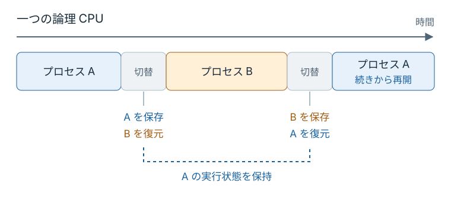

# はじめに

`sleep(1)` は、1 秒間待ってから処理を続けたいときに使う。
では、同じ CPU を別のプロセスが使い続けていたら、いつ戻ってくるだろうか。

一つの論理 CPU で同時に実行できる処理は一つである。
Linux が CPU を割り当てる実行単位を **タスク** と呼び、どのタスクを動かすかを **スケジューラ** が決める。
各1スレッドのプロセス A と B なら、下のように交代して CPU を使う。

CPU で動くタスクを切り替えるとき、OS は中断するタスクのレジスタなどの実行状態を保存し、次のタスクの状態を復元する。
この切り替えを **コンテキストスイッチ** と呼ぶ。
保存した状態を復元すれば、中断したタスクは続きから実行できる。

<figure class="technical-figure">

<figcaption>一つの論理 CPU で、各1スレッドのプロセス A と B を切り替える例。区間の長さは実際の所要時間を表さない。</figcaption>
</figure>

タスクが I/O やタイマーを待っている間は、CPU を必要としない待ち状態にある。
待っていた条件が満たされると、タスクは再び実行可能になる。
この状態変化を Linux のスケジューリングでは **wakeup** と呼ぶ。

`sleep(1)` のタイマーが満了した A は、すぐに実行を再開するか、それとも B が CPU を譲るまで待つか。
タイマーが満了しても、A が使う CPU を予約していたわけではない。
B が長く CPU を使う方針なら、A は実行可能になった後も待つことになる。

<figure class="technical-figure">

<figcaption>wakeup と処理再開の違い。黄色の区間が、実行可能になってから CPU を待つ時間に当たる。狭い画面では図を横にスクロールできる。</figcaption>
</figure>

この待ち時間に影響する「誰に、どれだけ CPU を渡すか」という判断を、自分の手で変えていく。
そのために使うのが、Linux の **`sched_ext`** である。
`sched_ext` は、BPF で記述した CPU スケジューラを実行時にカーネルへ読み込む仕組みで、カーネルを書き換えて再起動せずに方針を差し替えられる。

## ユーザ空間からカーネルの判断に差し込む

`sched_ext` へ渡すプログラムには、カーネル内部で動かすための形式と制約がある。
その仕組みが **BPF** であり、ユーザ空間のプログラムからカーネルへロードできる。
カーネルのソースコードそのものを書き換えるのではなく、カーネルがあらかじめ用意した場所へ処理を差し込み、その場所で起きる判断に参加できる。

BPF プログラムをロードすると、まずカーネルの **verifier** が、そのプログラムを実行してよいか検査する。
検査を通過したプログラムは、カーネルが許可した機能を使って判断に参加する。

`sched_ext` では、CPU の候補を選ぶときや、次に実行するタスクを求めるときに、このプログラムが呼ばれる。
このように、決められたタイミングで呼ばれる関数を **callback** と呼ぶ。
自分で書いた数行が実際のスケジューリング経路に入り、周期タスクの再開時刻へ影響する。

<figure class="technical-figure">

<figcaption>BPF のロードと実行の場所。verifier によるロード時の検査と、接続後の callback の呼び出しは、別の段階で行われる。</figcaption>
</figure>

最初は用意されたスケジューラを動かし、終了して元へ戻す。
一度動いたコードを一行変え、その値がタスクへ渡る場所を読む。
待ち行列を自分で扱えるようになったら、1 秒周期のタスクを意図的に遅らせ、設定を変えて待ち時間を比べる。
最後には、冒頭の A が待つ時間を、変更したコードと測定値に結び付けて説明できるようになる。

本文の問いは、直前の図やコードを見ながら、頭の中で一つ選ぶ程度でよい。
理由はすぐ後に書いてあるので、迷ったらそのまま読み進めて確かめてほしい。

## 想定する読者

次の知識を前提とする。

- C と Rust のコードを読んだ経験がある
- Linux のコマンドラインを操作できる

BPF、カーネル開発、スケジューラの実装経験は前提にしない。
前提としない用語は、必要になる章の中で説明する。

## 作るスケジューラ

本編では、先に並んだタスクから扱う **FIFO** のスケジューラを作る。
待ち行列と CPU を渡す時間を一つずつ変更すると、どの変更が観測値へ影響したかを追いやすい。
重みに応じた公平性、優先度、キャッシュや NUMA を考慮した配置は、発展編へ進むときの設計課題とする。

本文で定義した用語は、後から引き直せるよう[用語集](./appendix/glossary.md)にまとめている。
初出時にすべて暗記する必要はない。

`sched_ext` の ABI には安定性の保証がないため、この教材は Ubuntu 26.04 の標準カーネルと `scx` v1.1.3 の組み合わせで検証している。
異なる組み合わせでは callback や、BPF から呼ぶカーネル関数の名前が変わる可能性がある。

## 実行上の注意

自作 scheduler は、VM 内で root 権限を使って動かす。
BPF verifier と、実行中のタスクの停滞を検出する **watchdog** は多くの失敗を止めるが、「任意の scheduler を安全に実行できる」という保証ではない。
日常利用している Linux ホストではなく、配布する Multipass VM を使う。
